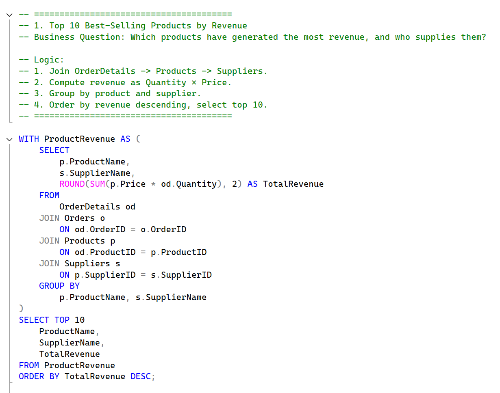
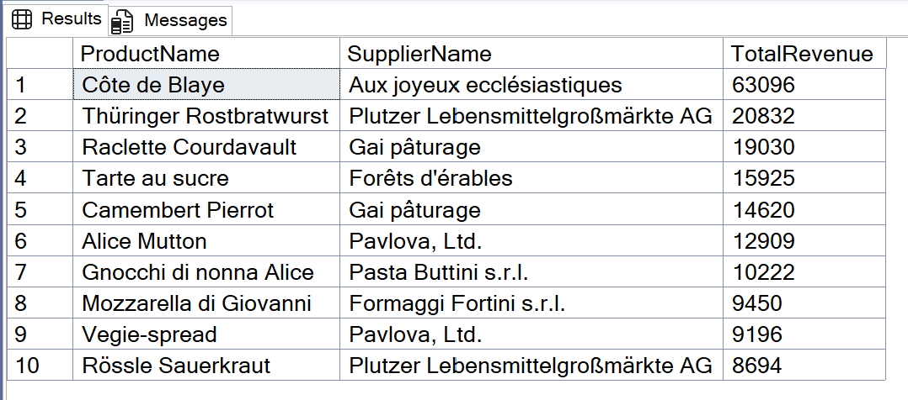

# Northwind Sales Analysis – SQL Portfolio Project

## Project Overview
This project demonstrates advanced SQL querying skills using the Northwind sample sales database.  
The objective is to answer realistic business questions related to sales, customer behavior, and supplier performance using T-SQL in SQL Server Management Studio (SSMS 21).

### The project covers:
- Snowflake schema analysis
- Complex joins, aggregations, and filtering
- Common Table Expressions (CTEs)
- Ranking and grouping operations
- Extracting date-based insights

---

## Database Schema
**Schema Design:** Snowflake

**Lookup Tables:**
- Suppliers
- Categories
- Customers
- Shippers
- Employees

**Bridge Tables:**
- Products (linked to Suppliers and Categories)
- Orders (linked to Customers, Shippers, Employees)

**Fact Table:**
- OrderDetails (linked to Products and Orders)

**Entity Relationships:**
- Suppliers (1) — ( * ) Products ( * ) — (1) Categories
- Customers (1) — ( * ) Orders ( * ) — (1) Shippers
- Employees (1) — ( * ) Orders ( * ) — (1) OrderDetails

---

## Business Questions Addressed
1. Top 10 Best-Selling Products by Revenue
2. High-Value Customers (Customer Lifetime Value)
3. Sales by Product Category and Country
4. Employee Sales Leaderboard
5. Supplier Contribution to Revenue
6. Monthly Sales Trend (2-Year Analysis)
7. Order Size and Frequency Analysis
8. Shipper Performance Analysis
9. High-Value Orders Breakdown

---

## Sample Query Snippet

---

## Sample Result Snippet

---

## Key Insights
- Top 10 Products: The top 10 best-selling products by revenue are led by premium items like Côte de Blaye and Thüringer Rostbratwurst, indicating that high-value gourmet and specialty foods drive the majority of sales.

- High-Value Customers: A small group of repeat buyers like Ernst Handel and Mère Paillarde generate a disproportionately high share of total revenue, highlighting the importance of nurturing loyal, high-spending customers.

- Category & Country: Beverages consistently dominate sales in most countries, with strong regional leaders like Austria, Brazil, Canada, and Denmark, while categories such as Dairy Products, Confections, and Meat/Poultry also contribute significantly in specific markets like Germany, USA, and Venezuela.

- Employee Leaders: Sales are heavily concentrated among top performers, with Margaret Peacock leading by a wide margin, followed by Janet Leverling and Robert King, while lower-ranked employees contribute far less overall revenue.

- Supplier Revenue Share: Revenue is heavily concentrated among a few key suppliers, with Aux joyeux ecclésiastiques, Plutzer Lebensmittelgroßmärkte AG, and Pavlova, Ltd. leading the list, while several niche suppliers hold 100% share within their product categories.
  
- Monthly Trends: Sales show strong seasonal peaks, with a steady rise from September through January culminating in the highest revenue in January 1997, followed by a sharp drop in February.

- Order Sizes: Orders are predominantly small, with most containing just 2 items, indicating frequent but low-volume purchasing behavior.

- Shipper Load: United Package handles the highest number of shipments, followed closely by Federal Shipping, while Speedy Express manages the smallest share of deliveries among the three.

- High-Value Orders: High-value orders are largely driven by premium products like Côte de Blaye and specialty gourmet items, with many orders combining multiple high-margin goods to reach substantial totals.

---

## Project Files
- `northwind_sql_analysis.sql` – All 9 queries with logic summaries
- `results/` – CSV outputs for each business question
- `northwind_schema.pdf` – ERD diagram of the database
- `SampleQuery.png` - Sample Query Snippet
- `SampleResult.png` - Sample Result Snippet
- `README.md` – This documentation

---

## Tools & Technologies
- SQL Server Management Studio 21 (SSMS 21)
- T-SQL
- Northwind Sample Database
- Entity Relationship Diagramming

---

## Usage
1. Install the Northwind sample database in SQL Server.
2. Open `northwind_sql_analysis.sql` in SSMS.
3. Execute each query to obtain results for the respective business question.
4. Refer to CSV files in the `results/` folder for exported outputs.
5. Check `northwind_schema.png` for database schema reference.

---

## Author
This project is part of a SQL portfolio developed to showcase proficiency in data analysis using advanced SQL techniques.

---

## Contact
For questions or collaboration, feel free to connect on LinkedIn: [Suyash Ratnaparkhi](https://linkedin.com/in/suyash-ratnaparkhi-a894a8373)
